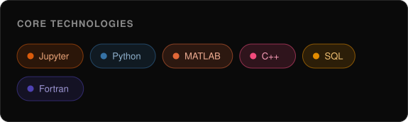

---
# Hi, I'm Helena

**Data Scientist & AI Developer | PhD Candidate in Physics & Computational Neuroscience | Machine Learning, RAG & LLMs**

  

---

### Languages

  

___

### Tech stack

---

---

### 📫 Get in touch

